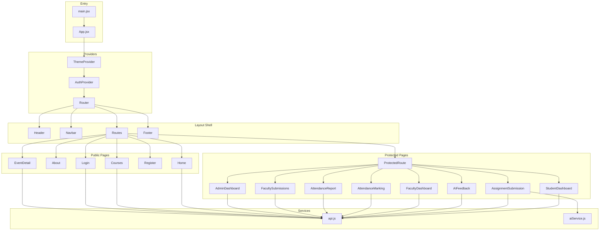

# Frontend Documentation — Vel Tech University Portal

> **Tech Stack:** React 19 + Vite 7 · React Router DOM 7 · Axios · react-icons  
> **Dev Server:** `http://localhost:5173` · **Backend API:** `http://localhost:8081/api`

---

## Table of Contents

1. [Project Structure Overview](#project-structure-overview)
2. [Entry Point Files](#entry-point-files)
3. [Context (State Management)](#context-state-management)
4. [Services (API & AI)](#services-api--ai)
5. [Components (Reusable UI)](#components-reusable-ui)
6. [Pages (Route-level Views)](#pages-route-level-views)
7. [Stylesheets (CSS)](#stylesheets-css)
8. [Assets](#assets)

---

## Project Structure Overview

```
frontend/src/
├── main.jsx                    # React DOM entry point
├── App.jsx                     # Root component with routing
├── App.css                     # App-level layout styles
├── index.css                   # Global theme, variables, utilities
│
├── assets/
│   └── react.svg               # Default Vite React logo asset
│
├── context/
│   ├── AuthContext.jsx          # Authentication state management
│   └── ThemeContext.jsx         # Dark/light theme toggle state
│
├── services/
│   ├── api.js                   # Axios HTTP client & API modules
│   └── aiService.js             # OpenRouter AI evaluation service
│
├── components/
│   ├── Header.jsx / Header.css         # Top university branding bar
│   ├── Navbar.jsx / Navbar.css         # Navigation bar with theme toggle
│   ├── Sidebar.jsx / Sidebar.css       # Dashboard sidebar navigation
│   ├── Footer.jsx / Footer.css         # Page footer with links & contacts
│   ├── ConfirmDialog.jsx / .css        # Modal confirmation dialog
│   └── ProtectedRoute.jsx             # Route guard (role-based auth)
│
└── pages/
    ├── Home.jsx / Home.css             # Landing page
    ├── About.jsx / About.css           # About the university
    ├── Courses.jsx / Courses.css       # Courses listing
    ├── Login.jsx / Login.css           # Login form (role-based)
    ├── Register.jsx                    # Student registration
    ├── EventDetail.jsx / .css          # Single event detail view
    ├── StudentDashboard.jsx            # Student dashboard
    ├── FacultyDashboard.jsx            # Faculty dashboard
    ├── AdminDashboard.jsx / .css       # Admin CRUD dashboard
    ├── AssignmentSubmission.jsx        # Student assignment upload
    ├── AIFeedback.jsx                  # AI evaluation results viewer
    ├── FacultySubmissions.jsx / .css   # Faculty: view student submissions
    ├── AttendanceMarking.jsx           # Faculty: mark attendance
    ├── AttendanceReport.jsx            # Faculty: attendance reports
    └── Dashboard.css                   # Shared dashboard layout styles
```

---

## Entry Point Files

### `main.jsx`
**Lines:** 11 · **Purpose:** Application bootstrap

The Vite entry point. Mounts the `<App />` component into the DOM root element (`#root`) wrapped in React's `<StrictMode>` for development warnings. Imports `index.css` for global styles.

**Key imports:** `react`, `react-dom/client`, `App.jsx`, `index.css`

---

### `App.jsx`
**Lines:** 99 · **Purpose:** Root component — routing & layout shell

Defines the entire application structure and route configuration. Wraps everything in:

1. `<ThemeProvider>` — global theme state
2. `<AuthProvider>` — global auth state
3. `<Router>` — client-side routing

**Layout structure:** `Header → Navbar → <main> (Routes) → Footer`

**Routes defined:**

| Path | Component | Access |
|------|-----------|--------|
| `/` | `Home` | Public |
| `/about` | `About` | Public |
| `/courses` | `Courses` | Public |
| `/login/:role` | `Login` | Public |
| `/register` | `Register` | Public |
| `/events/:id` | `EventDetail` | Public |
| `/student/dashboard` | `StudentDashboard` | Student only |
| `/student/assignments` | `AssignmentSubmission` | Student only |
| `/student/feedback/:id` | `AIFeedback` | Student only |
| `/faculty/dashboard` | `FacultyDashboard` | Faculty only |
| `/faculty/attendance` | `AttendanceMarking` | Faculty only |
| `/faculty/reports` | `AttendanceReport` | Faculty only |
| `/faculty/submissions` | `FacultySubmissions` | Faculty only |
| `/admin/dashboard` | `AdminDashboard` | Admin only |

Protected routes use `<ProtectedRoute requiredRole="ROLE">` wrapper.

---

### `App.css`
**Lines:** ~10 · **Purpose:** Minimal app-level layout

Contains the `.app` container's flex layout and `.app-content` minimum height to push the footer down.

---

## Context (State Management)

### `AuthContext.jsx`
**Lines:** 91 · **Purpose:** Authentication state + login/logout logic

**Exports:** `AuthProvider` (component), `useAuth()` (hook)

**State managed:**
- `user` — current logged-in user object (`{ id, name, email, role, department, token }`)
- `loading` — whether auth state is being initialized

**Key functions:**
- `login(credentials)` — calls `POST /api/auth/login`. On success, stores user in `localStorage` under key `universityPortalUser`. If the backend is unreachable, falls back to **mock users** (5 hardcoded users covering Student, Faculty, Admin roles).
- `logout()` — clears user state and removes from `localStorage`.

**On mount:** Reads saved user from `localStorage`, validates token via `GET /api/auth/me`, and refreshes user data.

**Mock credentials (fallback):**

| Email | Password | Role |
|-------|----------|------|
| `arjun@veltech.edu` | `student123` | STUDENT |
| `priya@veltech.edu` | `student123` | STUDENT |
| `ramesh@veltech.edu` | `faculty123` | FACULTY |
| `anita@veltech.edu` | `faculty123` | FACULTY |
| `admin@veltech.edu` | `admin123` | ADMIN |

---

### `ThemeContext.jsx`
**Lines:** 31 · **Purpose:** Dark/light theme toggle

**Exports:** `ThemeProvider` (component), `useTheme()` (hook)

**State managed:**
- `theme` — `'dark'` or `'light'` (default: `'dark'`)

**How it works:**
1. Reads initial theme from `localStorage` (key: `theme`)
2. Applies `data-theme` attribute to `<html>` element
3. `toggleTheme()` switches between dark and light
4. CSS rules in `index.css` use `[data-theme='light']` selector for overrides

---

## Services (API & AI)

### `api.js`
**Lines:** 152 · **Purpose:** Centralized HTTP client & all API endpoint functions

**Base URL:** `http://localhost:8081/api`

Creates an Axios instance with:
- Default `Content-Type: application/json`
- Request interceptor that attaches JWT `Bearer` token from `localStorage`

**Exported API modules:**

| Module | Endpoints | Description |
|--------|-----------|-------------|
| `authAPI` | `login()`, `me()` | Authentication |
| `universityAPI` | `getInfo()`, `getEvents()`, `getEventById(id)` | University info & events |
| `courseAPI` | `getAll()`, `getStudents(courseId)` | Course management |
| `attendanceAPI` | `mark(data)`, `getByDate()`, `getReport()`, `getStudentSummary()` | Attendance operations |
| `assignmentAPI` | `getByCourse()`, `upload(formData)`, `getByStudent()` | Assignment submissions |
| `aiFeedbackAPI` | `getBySubmission(id)` | AI feedback retrieval |
| `facultyAPI` | `getSubmissions(courseId)`, `getFeedback(id)` | Faculty-specific views |
| `dashboardAPI` | `getStudent(id)`, `getFaculty(id)` | Dashboard data |
| `adminAPI` | CRUD for events & news (`getEvents`, `createEvent`, `updateEvent`, `deleteEvent`, `getNews`, `createNews`, `updateNews`, `deleteNews`) | Admin management |

---

### `aiService.js`
**Lines:** 143 · **Purpose:** Client-side AI assignment evaluation via OpenRouter

**Environment variables:**
- `VITE_OPENROUTER_API_KEY` — API key for OpenRouter
- `VITE_OPENROUTER_MODEL` — AI model (default: `deepseek/deepseek-chat`)

**Exported functions:**

| Function | Description |
|----------|-------------|
| `evaluateAssignment({ assignmentTitle, courseName, fileContent })` | Sends the assignment content to OpenRouter's chat completions API with a system prompt requesting structured JSON feedback. Returns `{ grammarScore, relevanceScore, originalityScore, overallScore, summary, suggestions[] }`. |
| `readFileContent(file)` | Reads a `File` object. For text files, extracts up to 3000 chars. For binary files, returns a descriptor string. |
| `isAIConfigured()` | Returns `true` if a valid API key is set. |

**Scoring criteria:** Grammar (writing quality), Relevance (topic alignment), Originality (creativity/depth), Overall (weighted average). All scores 0-100.

---

## Components (Reusable UI)

### `Header.jsx`
**Lines:** 22 · **Purpose:** Top university branding banner

Displays the Vel Tech University logo image (`/image.png`) and name with motto text. Links to the home page (`/`). Styled via `Header.css`.

---

### `Navbar.jsx`
**Lines:** ~161 · **Purpose:** Main navigation bar with role-aware links & theme toggle

**Features:**
- **Public links:** Home, About, Courses
- **Auth-aware links:** Login buttons (Student, Faculty, Admin) when logged out; Dashboard, role-specific links, Logout when logged in
- **Theme toggle button** with animated 360° spin on click (sun/moon icons)
- **User avatar** showing the first letter of the user's name
- **Hamburger menu** for mobile responsive navigation
- **Logout confirmation** via `ConfirmDialog`

**Hooks used:** `useAuth()`, `useTheme()`, `useLocation()`, `useRef`

---

### `Sidebar.jsx`
**Lines:** ~131 · **Purpose:** Dashboard sidebar navigation for students and faculty

Renders different navigation links based on user role:
- **Student:** Dashboard, Submit Assignment, AI Feedback
- **Faculty:** Dashboard, Mark Attendance, View Reports, View Submissions

Uses `react-icons` (Feather Icons) for all navigation items. Shows the user's name, role badge, and avatar. Highlights the active route using `useLocation()`.

---

### `Footer.jsx`
**Lines:** 67 · **Purpose:** Page footer with links and contact information

Contains three columns:
1. **Brand** — University name, description, social media icons (Facebook, Twitter, LinkedIn, Instagram as inline SVGs)
2. **Quick Links** — About, Courses, Student Portal, Faculty Portal
3. **Contact** — Email, phone, and address

Displays copyright year dynamically.

---

### `ConfirmDialog.jsx`
**Lines:** 26 · **Purpose:** Reusable modal confirmation dialog

**Props:** `show`, `title`, `message`, `confirmText`, `cancelText`, `onConfirm`, `onCancel`, `type`

Renders a centered overlay with a dialog box. Supports two types:
- `danger` — red styling with trash icon (used for delete confirmations)
- `warning` — yellow styling with warning icon (used for logout confirmations)

Clicking outside the dialog triggers `onCancel`.

---

### `ProtectedRoute.jsx`
**Lines:** 25 · **Purpose:** Route guard for role-based access control

**Props:** `children` (the protected page), `requiredRole` (e.g., `'STUDENT'`, `'FACULTY'`, `'ADMIN'`)

**Behavior:**
1. If `loading` — shows a spinner
2. If not logged in — redirects to `/login/{role}`
3. If logged in but wrong role — redirects to `/` (home)
4. If authorized — renders the children

---

## Pages (Route-level Views)

### `Home.jsx`
**Lines:** ~100 · **Purpose:** Landing page — public homepage

**Sections:**
1. **Hero banner** — welcome message, university name, CTA buttons
2. **Portal buttons** — Student, Faculty, Admin login shortcuts with react-icons
3. **Events & News** — fetched from `universityAPI.getEvents()`, displayed as a grid of cards (each links to `/events/:id`). Falls back to hardcoded sample events.
4. **Announcement ticker** — scrolling text banner

**API used:** `GET /api/university/events`

---

### `About.jsx`
**Lines:** 92 · **Purpose:** About the university — static informational page

**Sections:**
1. **Hero** — "Shaping Minds Since 1985" headline
2. **Mission & Vision** — two glass-card columns
3. **Core Values** — 4 values (Excellence, Innovation, Integrity, Diversity) rendered from a data array with emoji icons
4. **Timeline** — 6 milestones from 1985 to 2025, rendered as a vertical timeline

Purely presentational — no API calls.

---

### `Courses.jsx`
**Lines:** 84 · **Purpose:** Courses listing page

Fetches courses from `GET /api/courses`. Falls back to 6 hardcoded courses (CS, Electronics, MBA, Data Science, AI, Biotechnology).

Each course card displays: icon, degree badge, duration, name, description, and subject chips. Courses from the API get icons mapped via an `iconMap` by department name.

---

### `Login.jsx`
**Lines:** ~130 · **Purpose:** Login form — supports Student, Faculty, Admin roles

**Route:** `/login/:role` — the `:role` param determines which login portal is shown.

**Features:**
- Email + password form
- Role-specific header icon and title
- Error message display
- Tab to switch between Student/Faculty/Admin login
- Admin login link at the bottom
- Demo credentials section for quick testing
- Redirects to the appropriate dashboard on success

**Hooks:** `useAuth()`, `useNavigate()`, `useParams()`

---

### `Register.jsx`
**Lines:** ~70 · **Purpose:** Student self-registration form

**Fields:** Name, Email, Password, Department (dropdown with 6 departments)

On submit, posts to the registration endpoint. Shows success/error messages with react-icons. Currently uses a simplified flow since backend registration may not be fully implemented.

---

### `EventDetail.jsx`
**Lines:** 101 · **Purpose:** Detailed view of a single event

**Route:** `/events/:id`

**Data loading strategy:**
1. First checks `location.state?.event` (passed from the Home page's event card click — instant load)
2. Falls back to `GET /api/university/events/{id}` API call

Displays: category badge, tag, title, formatted date, location, status, and full description. Has a "Back to Events" link.

---

### `StudentDashboard.jsx`
**Lines:** ~110 · **Purpose:** Student's main dashboard

**Features:**
- Welcome greeting with logged-in student name
- **Quick action buttons:** Submit Assignment, View Feedback, Attendance
- **Stats cards:** Total assignments, average score, attendance %, pending submissions
- **Recent submissions list** with grade badges

**API used:** `GET /api/dashboard/student/{studentId}` — falls back to mock data.

**Layout:** Uses `<Sidebar>` on the left with main content area on the right.

---

### `FacultyDashboard.jsx`
**Lines:** ~140 · **Purpose:** Faculty's main dashboard

**Features:**
- Welcome greeting with faculty name
- **Quick action buttons:** Mark Attendance, View Reports, View Submissions
- **Stats cards:** Total courses, total students, attendance rate, assignments graded
- **Recent activity list**

**API used:** `GET /api/dashboard/faculty/{facultyId}` — falls back to mock data.

---

### `AdminDashboard.jsx`
**Lines:** 307 · **Purpose:** Admin CRUD dashboard for managing events and news

**Features:**
- **Tab navigation:** Events tab and News tab
- **CRUD operations:** Create, Read, Update, Delete for both events and news
- **Modal form** for creating/editing items with fields: title, description, date, category/tag, location (events) or author (news)
- **Delete confirmation** via `ConfirmDialog`
- **Items table** with action buttons (Edit, Delete)

**APIs used:** `adminAPI.getEvents()`, `createEvent()`, `updateEvent()`, `deleteEvent()` and equivalent for news.

**Internal functions:** `fetchData()`, `openCreateModal()`, `openEditModal()`, `closeModal()`, `handleChange()`, `handleSubmit()`, `handleDelete()`, `confirmDelete()`

---

### `AssignmentSubmission.jsx`
**Lines:** ~290 · **Purpose:** Student assignment upload with AI evaluation

**Workflow:**
1. Student selects a course from dropdown
2. Assignments for that course are loaded
3. Student selects an assignment and uploads a file
4. On submit, file is uploaded to backend (`POST /api/assignments/upload`)
5. If AI is configured (`isAIConfigured()`), the file content is read and sent to OpenRouter for evaluation
6. AI feedback (scores + suggestions) is displayed inline

**APIs used:** `courseAPI.getAll()`, `assignmentAPI.getByCourse()`, `assignmentAPI.upload()`, `evaluateAssignment()`

**Fallback data:** Hardcoded courses and assignments for when backend is unavailable.

---

### `AIFeedback.jsx`
**Lines:** ~100 · **Purpose:** View AI evaluation results for a specific submission

**Route:** `/student/feedback/:id`

Fetches feedback from `GET /api/ai-feedback/submission/{submissionId}`. Displays:
- Overall score (large circular display)
- Individual scores: Grammar, Relevance, Originality
- Summary text
- Suggestions list

Falls back to mock feedback data.

---

### `FacultySubmissions.jsx`
**Lines:** ~200 · **Purpose:** Faculty view of all student submissions for a course

**Features:**
- Course selector dropdown
- Submissions table showing: student name, file name, submission date, status, grade
- Inline AI feedback viewer — faculty can click "View" on evaluated submissions to see the AI feedback

**APIs used:** `dashboardAPI.getFaculty()`, `facultyAPI.getSubmissions()`, `facultyAPI.getFeedback()`

---

### `AttendanceMarking.jsx`
**Lines:** ~198 · **Purpose:** Faculty marks student attendance

**Workflow:**
1. Select a course → students are loaded for that course
2. Set the date (defaults to today)
3. Check/uncheck each student as Present/Absent
4. Submit → `POST /api/attendance` with array of attendance records

**APIs used:** `courseAPI.getAll()`, `courseAPI.getStudents()`, `attendanceAPI.mark()`

**Fallback:** Hardcoded course and student data.

---

### `AttendanceReport.jsx`
**Lines:** 210 · **Purpose:** Faculty views attendance reports by course and date range

**Features:**
- Course selector and date range picker (from/to)
- Fetches attendance data from backend or uses fallback mock data
- Displays a table with student names and attendance status
- Summary statistics (total present, absent, attendance percentage)
- Clear filters button

**APIs used:** `courseAPI.getAll()`, `attendanceAPI.getReport()`

---

## Stylesheets (CSS)

### `index.css`
**Lines:** ~820 · **Purpose:** Global styles, CSS variables, and theme definitions

**Contains:**
- **CSS variables** (`:root`) for the entire design system: colors, gradients, typography, spacing, border-radius, transitions
- **`[data-theme='light']` overrides** for the light theme
- **Base element styles:** body, headings, links, scrollbar, selection
- **Utility classes:** `.container`, `.section`, `.glass-card`, badges, buttons, spinners
- **Animation keyframes:** `fade-in-up`, `slide-in-left`, `pulse-glow`, `theme-spin`
- **Theme toggle button** styles with spin animation
- **Sidebar** light-theme overrides
- **Footer** and **ConfirmDialog** light-theme overrides
- **Responsive breakpoints** for mobile/tablet

**Color palette (dark theme):** Deep navy (`#0a0e1a`) backgrounds, blue accents (`#3b82f6`), white text  
**Color palette (light theme):** White/slate backgrounds, blue accents, dark text

---

### `App.css`
**Lines:** ~10 · **Purpose:** App shell layout (flex column, min-height)

---

### `Header.css`
**Purpose:** Styles for the top branding bar — gradient background, logo sizing, text hierarchy, responsive adjustments

---

### `Navbar.css`
**Purpose:** Navigation bar layout — flex row, link hover effects, hamburger menu animation, user avatar styles, dropdown positioning, mobile responsive collapse

---

### `Sidebar.css`
**Purpose:** Dashboard sidebar — fixed position, scrollable nav links, active state styling, user info section, role badges, responsive collapse for mobile

---

### `Footer.css`
**Purpose:** Footer layout — multi-column grid, social icon hover effects, link styles, contact list, copyright bar, responsive stacking

---

### `ConfirmDialog.css`
**Purpose:** Modal overlay — centered dialog, backdrop blur, icon animation, button styles (danger/warning variants), entry animation

---

### `Home.css`
**Purpose:** Landing page — hero gradient, portal button grid, event cards grid, announcement ticker marquee animation, responsive adjustments

---

### `About.css`
**Purpose:** About page — hero section, mission/vision card grid, core values grid, vertical timeline with dot connectors, responsive stacking

---

### `Courses.css`
**Purpose:** Courses page — hero section, course card grid, subject chips, degree badges, hover lift effects, responsive grid

---

### `Login.css`
**Purpose:** Login page — centered card layout, form fields, role tab switcher, demo credentials box, error styling

---

### `EventDetail.css`
**Purpose:** Event detail page — centered content card, metadata info items, back link, responsive padding

---

### `AdminDashboard.css`
**Purpose:** Admin dashboard — tab navigation, data tables, modal overlay, form fields, CRUD action buttons, responsive table scrolling

---

### `FacultySubmissions.css`
**Purpose:** Submissions table — scrollable table, status badges, expandable feedback section, responsive adjustments

---

### `Dashboard.css`
**Purpose:** Shared dashboard layout — `.dashboard-layout` flex grid (sidebar + content), stats cards grid, quick action buttons, welcome section, recent items list, responsive breakpoints

---

## Assets

### `assets/react.svg`
The default React logo SVG that comes with Vite's React template. Not actively used in the application UI.

### `/public/image.png`
The Vel Tech University logo displayed in the `Header.jsx` component. Served from the `public/` directory.

---

## Architecture Diagram


